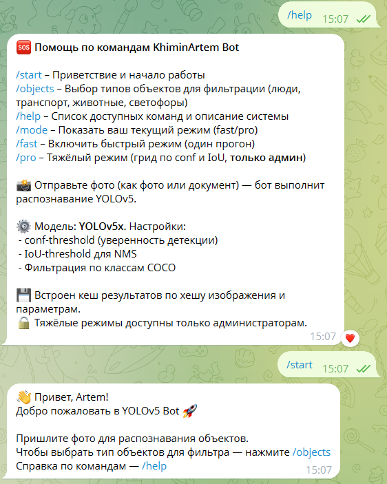
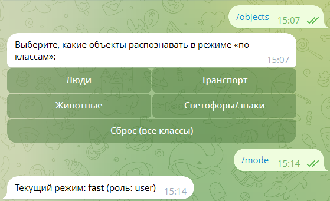
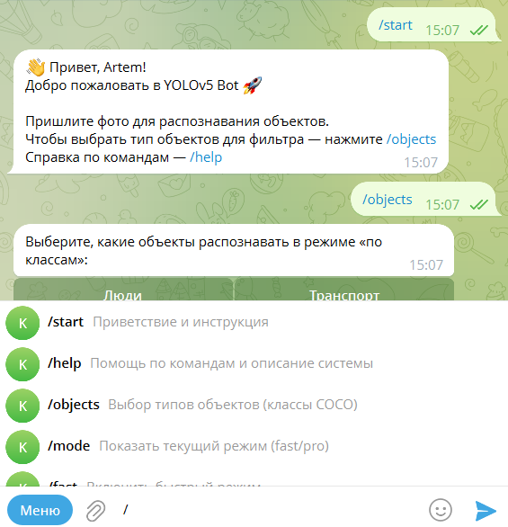
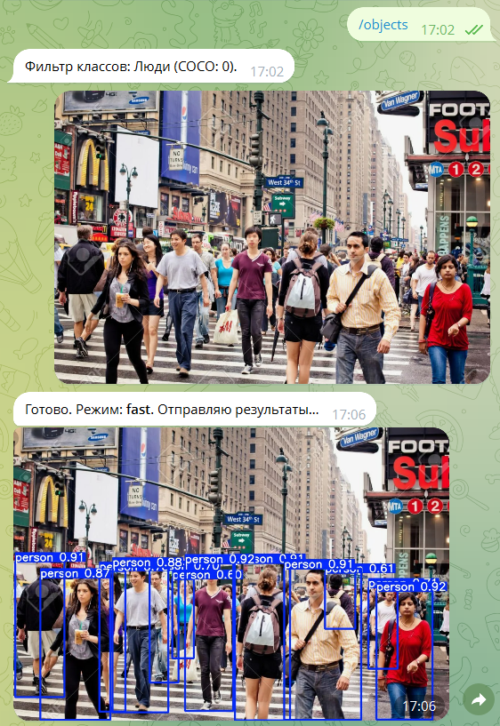
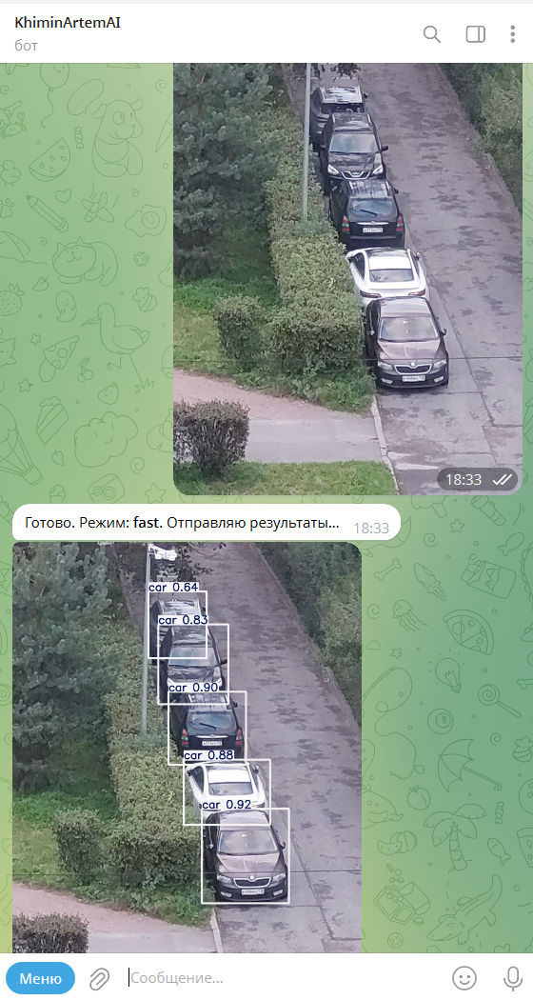

# 🤖 KhiminArtem YOLOv5 Telegram Bot

Telegram-бот для **распознавания объектов на изображениях** с помощью модели **YOLOv5x** (через TerraYoloV5).  
Поддерживает выбор классов, кеширование результатов, разные режимы работы (fast/pro), а также подсказки команд при вводе `/`.

---

## 🚀 Возможности
- 📸 Распознавание объектов на фото или картинках.
- 🎛 Выбор типов объектов (люди, транспорт, животные, знаки).
- ⚡ Два режима работы:
  - **Fast** — быстрый прогон (одно распознавание).
  - **Pro** — грид по `conf` и `IoU` (только для админов).
- 💾 Кеширование результатов по хэшу изображения и параметрам.
- 🔒 Защита от перегрузки: один запрос на пользователя одновременно.
- ⏱ Тайм-аут на долгие задачи (180 секунд).
- ✅ Подсказки команд (Bot Commands) при вводе `/`.

---

## 🛠 Стек технологий
- Python 3.10+
- [python-telegram-bot 20+](https://docs.python-telegram-bot.org/)
- [TerraYoloV5](https://github.com/ultralytics/yolov5)
- dotenv
- asyncio

---

## 📂 Структура проекта

